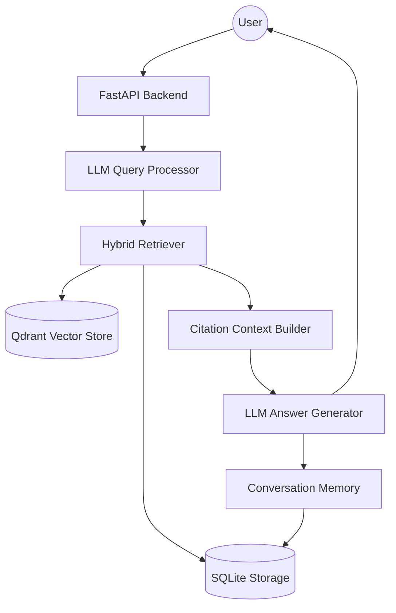

# 🇻🇳 Vietnam Tourism RAG Pipeline

Một hệ thống **Retrieval-Augmented Generation (RAG)** tiên tiến, được thiết kế chuyên biệt cho lĩnh vực du lịch Việt Nam. Dự án kết hợp sức mạnh của tìm kiếm Hybrid (Dense + Sparse), xử lý truy vấn bằng LLM và quản lý bộ nhớ hội thoại thông minh để cung cấp trải nghiệm trả lời tự động chính xác và tự nhiên.


---

## 🚀 Tính Năng Nổi Bật

### 🔍 Hybrid Retrieval Engine
Kết hợp hai phương pháp tìm kiếm mạnh mẽ nhất hiện nay trong cùng một Qdrant collection:
- **Dense Retrieval**: Sử dụng vector embeddings để bắt trọn ý nghĩa ngữ nghĩa (semantic meaning).
- **Sparse Retrieval**: Sử dụng BM25 để tìm kiếm chính xác từ khóa (keyword matching), cực kỳ hiệu quả với các tên địa danh, đặc sản Việt Nam.
- **RRF Fusion**: Sử dụng thuật toán *Reciprocal Rank Fusion* để hợp nhất kết quả từ cả hai phương pháp, đảm bảo độ chính xác tối đa.

### 🧠 Thông Minh Hóa Truy Vấn (Query Processing)
Không chỉ tìm kiếm đơn thuần, hệ thống sử dụng LLM để:
- **Query Rewriting**: Viết lại câu hỏi của người dùng để tối ưu cho việc tìm kiếm (ví dụ: biến "chỗ đó" thành "Vịnh Hạ Long" dựa trên ngữ cảnh).
- **Intent Detection**: Phân tích ý định người dùng để điều chỉnh chiến lược retrieval.

### 💾 Quản Lý Bộ Nhớ Hội Thoại (Stateful Memory)
Hỗ trợ ghi nhớ ngữ cảnh phiên làm việc thông qua `session_id`:
- **Conversation Store**: Lưu trữ toàn bộ lịch sử trò chuyện trong SQLite.
- **Memory Compaction**: Khi lịch sử quá dài, hệ thống tự động tóm tắt (summarize) các lượt hội thoại cũ bằng LLM, giúp giảm chi phí token mà vẫn giữ được mạch câu chuyện.
- **Automatic GC**: Tự động dọn dẹp các session không hoạt động sau 24 giờ.

### ⚡ Trải Nghiệm Thời Gian Thực
- **Streaming Response**: Hỗ trợ stream token qua SSE (Server-Sent Events), mang lại cảm giác phản hồi tức thì như ChatGPT.
- **Citation System**: Trích dẫn nguồn rõ ràng từ tập dữ liệu, giúp người dùng dễ dàng đối chiếu thông tin.

---

## 🛠 Kiến Trúc Hệ Thống

Hệ thống được xây dựng theo mô hình phân tầng modular:



**Luồng dữ liệu chính:**
`User Query` $\rightarrow$ `Rewrite/Intent` $\rightarrow$ `Hybrid Search` $\rightarrow$ `Context Construction` $\rightarrow$ `LLM Generation` $\rightarrow$ `Streaming Output`

---

## 📦 Cài Đặt & Chạy Thử

### Yêu cầu hệ thống
- Python 3.10+
- Node.js 18+
- Qdrant (Docker)

### 1. Thiết lập Backend
```bash
# Tạo môi trường ảo và cài đặt dependencies
python -m venv .venv
source .venv/bin/activate  # Linux/Mac
# .\.venv\Scripts\activate  # Windows

pip install -r pyproject.toml # hoặc pip install .
```

**Khởi chạy API:**
```bash
$env:PYTHONIOENCODING="utf-8"
python -m rag_pipeline.api.app
```
API sẽ chạy tại: `http://localhost:8000` (Swagger UI: `/docs`)

### 2. Thiết lập Frontend
```bash
cd frontend
npm install
npm run dev
```
Frontend sẽ chạy tại: `http://localhost:5173`

### 3. Chạy nhanh với Docker (Production mode)
```bash
docker compose up -d
```

---

## 📂 Cấu Trúc Dự Án

```text
├── data/                  # SQLite database & local storage
├── docs/                  # Tài liệu chi tiết (Dataset, Storage, Retrieval, ...)
├── frontend/              # React application (Vite + Tailwind)
├── scripts/               # Công cụ hỗ trợ (Ingest, Benchmark, Demo)
└── src/
    └── rag_pipeline/
        ├── api/           # FastAPI endpoints & dependencies
        ├── generation/     # LLM Generation & Memory management
        ├── retrieval/      # Hybrid search & Query preprocessing
        └── storage/        # SQLite persistence layer
```

---

## 📊 Tài Liệu Chi Tiết

Vui lòng tham khảo thư mục `docs/` để biết thêm chi tiết về:
- [Dataset](docs/dataset.md): Mô tả bộ dữ liệu Vietnam Tourism v2.
- [Storage](docs/storage.md): Kiến trúc lưu trữ phân tầng.
- [Retrieval](docs/retrieval.md): Chi tiết về Hybrid Search và RRF.
- [Generation](docs/generation.md): Cơ chế tạo câu trả lời và trích dẫn.
- [Memory](docs/memory.md): Quản lý phiên hội thoại và nén bộ nhớ.
- [Evaluation](docs/eval.md): Cách đánh giá chất lượng RAG với LLM Judge.

---

## 🎯 Mục Tiêu Phát Triển
- [x] Xây dựng Pipeline Hybrid Search (Dense + Sparse).
- [x] Tích hợp Memory Compaction cho hội thoại dài.
- [x] Triển khai Streaming SSE cho Frontend.
- [ ] Hỗ trợ đa dạng hơn các nguồn dữ liệu (PDF, Web Scraping).
- [ ] Tối ưu hóa latency thông qua caching nâng cao.
- [ ] Phát triển hệ thống đánh giá tự động (Auto-Eval) sâu hơn.
